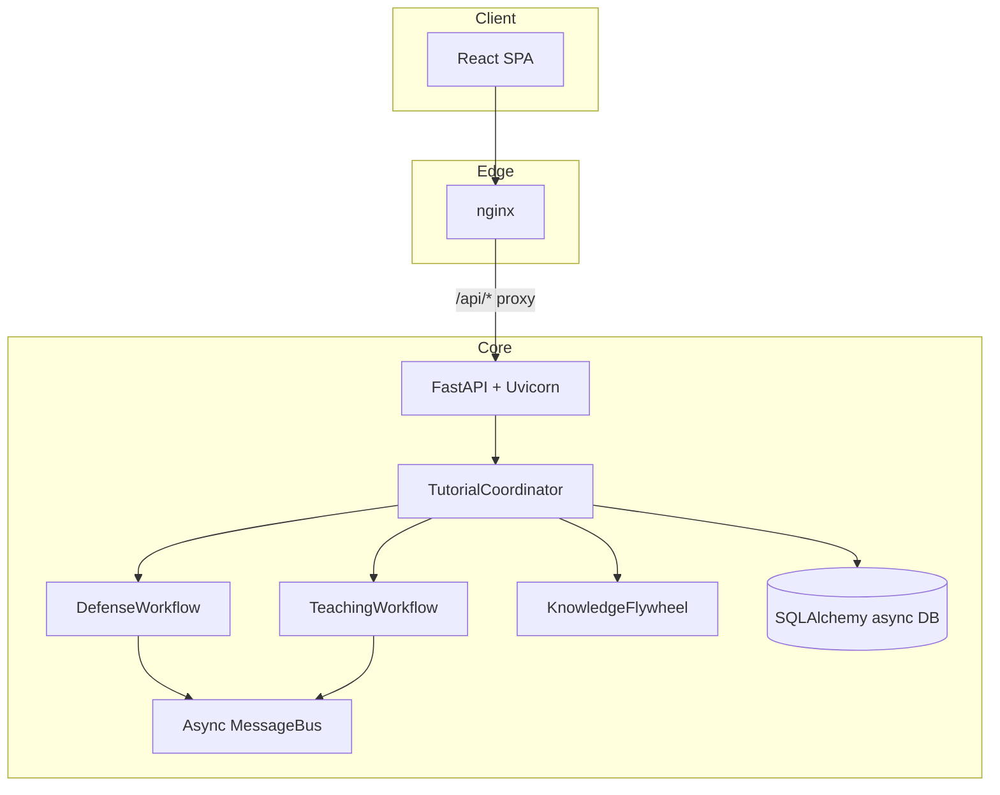

# TUTORIAL System Architecture

Project TUTORIAL is a **defense-first, teaching-second** platform: LangGraph workflows investigate
persisted incidents, then emit lessons, curriculum mappings, and optional blockchain credentials. A
FastAPI application exposes JSON and WebSocket interfaces; a React SPA provides operator and student
experiences.

## High-level diagram

## Components

| Component | Responsibility |
| --- | --- |
| `api/` | HTTP routers, auth (demo API key), rate limiting, OpenAPI. |
| `orchestration/coordinator.py` | Submits incidents, owns agent pools, bridges workflows. |
| `orchestration/defense_workflow.py` | LangGraph defense graph with checkpoints and persistence hooks. |
| `orchestration/teaching_workflow.py` | LangGraph teaching graph emitting lessons and CSTA coverage. |
| `core/message_bus.py` | In-process async pub/sub with TTL and dead-letter tracking. |
| `database/` | Async SQLAlchemy models, CRUD, seed data. |
| `integrations/` | MCP client/registry, Splunk helpers, bundled MCP servers. |
| `agents/` | Specialized agents (defense, teaching, investigation, etc.). |
| `platforms/` | Splunk, UiPath, blockchain, edge helpers. |
| `knowledge/` | Concept extraction and graph fusion. |
| `tutorial/` | Bootstrap CLI entrypoints and operational health checks. |
| `frontend/` | Vite + React dashboard, lessons, sandbox, credentials UI. |

## Data flow (incident → lesson)

1. Client `POST /api/v1/incidents/` persists an `Incident` row.
2. `POST /api/v1/incidents/{id}/investigate` loads ORM data, converts to shared models, and calls
   `TutorialCoordinator.submit_incident`.
3. Defense workflow runs with checkpoint sqlite databases under configurable paths.
4. `sync_defense_and_teach_post_submit` reconciles graph outputs back into SQL tables (steps, evidence,
   accuracy metadata, lessons).
5. `GET /api/v1/incidents/{id}` returns investigation steps, evidence, and lesson summaries.
6. WebSocket `/api/v1/ws/events` streams coordinator events for dashboards.

## Technology stack

| Layer | Technology |
| --- | --- |
| Language | Python 3.11+ |
| API | FastAPI, Starlette middleware |
| Agents | LangGraph, langgraph-checkpoint-sqlite |
| ORM | SQLAlchemy 2 asyncio, Alembic migrations |
| Frontend | React 18, Vite, TypeScript, Tailwind |
| Logging | structlog + YAML-driven stdlib logging |
| Packaging | hatchling, optional `[dev]` and `[edge]` extras |

## Decision log

| Decision | Rationale |
| --- | --- |
| LangGraph | First-class checkpointing, async nodes, and typed state for defense/teaching graphs. |
| SQLite defaults | Zero-config hackathon demos; Postgres supported for production scale. |
| In-process message bus | Simplicity and low latency; Redis not required for core correctness. |
| Demo API key auth | Judges can run locally without IdP; swap for OAuth in production. |
| nginx + SPA | Single origin for `/api/v1` when `VITE_API_URL=/api/v1` at build time. |

## Related documents

- `docs/DEPLOYMENT.md` — Docker, Compose, edge, and Kubernetes notes.
- `docs/API.md` — Endpoint catalog and OpenAPI regeneration.
- `docs/HACKATHON_SUBMISSIONS.md` — Per-hackathon submission index.
