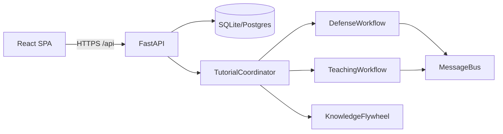

# TUTORIAL-Identity: Investigation Narratives Grounded in Auth Signals

**Tagline:** Who did what, when, and why it matters for IAM teams.

## Problem

Security teams drown in alerts while new analysts lack realistic, safe rehearsal environments.
Universities and nonprofits cannot afford bespoke SOC simulators. The result: slower response,
opaque investigations, and a widening cyber skills gap.

## Solution

**Project TUTORIAL** couples LangGraph-powered defense workflows with a teaching pipeline that
turns every resolved incident into CSTA-aligned lessons, interactive elements, and optional
verifiable credentials. Operators get structured timelines with explicit self-correction;
students get narratives grounded in the same evidence professionals saw.

## Hackathon angle: `okta_identity_hack`

Login failure heuristics, session risk storytelling, and student profiles that respect API-key authentication patterns common in enterprise pilots.

## Key features

- FastAPI surface with `/api/v1/incidents`, investigations, lessons, students, knowledge graph,
  and WebSocket fan-out for live dashboards.
- SQLite-first persistence with optional PostgreSQL for scale (see `docs/DEPLOYMENT.md`).
- MCP registry for Splunk, security tools, LLM, and partner integrations.
- Accuracy report endpoint per incident for FIND EVIL!-style scoring narratives.
- Docker Compose stack with health-checked API and nginx-served React SPA.

## Technology stack

| Layer | Choice |
| --- | --- |
| API | FastAPI, Uvicorn, Pydantic v2 |
| Agents | LangGraph, structlog, asyncio |
| Persistence | SQLAlchemy 2 async, SQLite / Postgres |
| Frontend | React, Vite, TypeScript, Tailwind |
| Ops | Docker multi-stage images, GitHub Actions CI |

## Architecture (conceptual)

## Demo instructions

1. `docker compose up -d --build` from the `tutorial/` directory.
2. `curl -H "X-API-Key: tutorial-demo-key" http://127.0.0.1:8000/api/v1/system/health`
3. POST `/api/v1/incidents/` with JSON body (see `docs/demo_scripts/find_evil_demo.sh`).
4. POST `/api/v1/incidents/{id}/investigate` then poll GET `/api/v1/incidents/{id}`.
5. Open `http://localhost` for the UI; Settings lets you override API base and key.

## Team

Populate this section in the hackathon portal with your roster (names, roles, emails, and
links to LinkedIn or GitHub). Keep this repository copy synchronized with whatever you submit
officially so judges can verify authorship.

## Roadmap

- Postgres-backed horizontal scaling for coordinator pools.
- Federated MCP credential vaults for multi-tenant SOC providers.
- Expanded ONNX lesson recommenders on ARM classroom kits.
